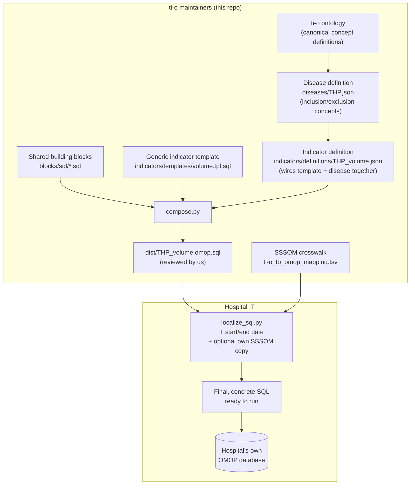

# ti-o indicator query pipeline — for maintainers

> **Status: proposal / proof of concept.** This setup is not finalized and is
> still being discussed with stakeholders. Everything below is a working
> draft of the architecture, not a committed design.

This document describes how **we** (ti-o maintainers) define, build, and
publish indicator queries so that hospitals can compute transparency
indicators consistently, regardless of which coding system or database
platform they use.

## Why this exists

Hospitals report the same transparency indicators (e.g. THP volume), but:
- they use different code systems for the same clinical concept (SNOMED,
  local/internal codes, ZA-codes, ...),
- they run different database platforms (OMOP CDM variants, FHIR, ...),
- the *logic* of an indicator (inclusion/exclusion criteria, reporting
  period) must stay identical across all of them, otherwise the numbers
  aren't comparable.

The pipeline below keeps indicator **logic** centrally owned and consistent,
while making code/vocabulary differences a hospital-side configuration
detail rather than something that requires touching the query itself.

## Architecture overview



Note the three separate concerns being kept apart on purpose:
- `indicators/templates/<kind>.tpl.sql` — the query LOGIC for one kind of
  indicator (e.g. `volume`), disease-agnostic.
- `diseases/<Disease>.yaml` — the inclusion/exclusion CRITERIA for one
  disease, as a named set of ti-o concepts. Indicator-agnostic, and not even
  SQL-specific, so a future SPARQL/FHIR pipeline could reuse the same
  disease files. Each criterion is either a plain YAML list of ti-o
  concepts (OR'd together automatically — no SQL knowledge needed), or a
  single raw SQL string containing `{{ti-o:...}}` tokens for cases needing
  more than a flat OR (AND/NOT/nested logic), authored directly by someone
  with SQL expertise.
- `indicators/definitions/<name>.yaml` — wires a template and a disease
  together, mapping template placeholders to that disease's criteria keys.

This split matters most for complex diseases: THP's criteria are a single
concept each for inclusion/exclusion, but e.g. head-and-neck malignancy
(`HeadNeckMalignancy.yaml`) needs five separate named criteria (primary
malignancy, resection, CIS, other excluded histology, reoperation) — that
complexity lives entirely in the disease file, not in the query template.

> **Dependency note:** `compose.py` uses PyYAML (`pip install pyyaml`) to
> read the `.yaml` files above — the one place in this pipeline that isn't
> stdlib-only. `localize_sql.py` (what hospitals run) remains stdlib-only;
> this dependency only affects maintainers running `compose.py`.

## The three files, and what each is responsible for

| File | Owned by | Purpose |
|---|---|---|
| `blocks/sql/*.sql` | maintainers | Reusable structural fragments (`rapportagejaar`, `locatie`) shared across every indicator, so we don't copy-paste the same boilerplate into every new indicator. |
| `indicators/templates/<kind>.tpl.sql` | maintainers | One template per *kind* of indicator logic (e.g. `volume`, `HHM_heroperatie`). Composes shared blocks via `${block_name}` and leaves `${some_token}` placeholders for whichever ti-o concepts the disease definition supplies. |
| `diseases/<Disease>.yaml` | maintainers | One file per disease, naming its inclusion/exclusion criteria (e.g. `inclusie_criteria: [ti-o:THP]`). This is where disease-specific complexity lives (e.g. `HeadNeckMalignancy.yaml` has 5 named criteria) — independent of any query template. |
| `indicators/definitions/<name>.yaml` | maintainers | One definition per indicator instance (e.g. `THP_volume.yaml`). Names which template + which disease it uses, and maps template tokens to disease criteria keys — this is the part hospitals cannot change. |
| `compose.py` | maintainers, run by us | Renders `template + disease + definition` → `dist/<name>.omop.sql`. This is the artifact **we read and review** before it goes to any hospital, to confirm the logic and default code mappings are correct. |
| `dist/<name>.omop.sql` | maintainers, committed | Plain SQL with two kinds of placeholders left in: `{{START_DATE}}`/`{{END_DATE}}` and `{{ti-o:...}}`. This is what we ship/publish. |
| `localize_sql.py` | maintainers, run by hospital | Hospital-facing script. Fills in the reporting period and resolves `{{ti-o:...}}` tokens via a SSSOM file (ours by default, or the hospital's own edited copy). Output is plain, final SQL. |
| `ti-o_to_omop_mapping.tsv` | maintainers (community-extendable) | The SSSOM crosswalk: which local/standard code corresponds to each ti-o concept. Hospitals can fork/extend this file for their own local codes. |

## Design decisions and why

- **Why not have hospitals write their own queries?**
  Different hand-written queries per hospital risk subtly different
  inclusion/exclusion logic, which breaks comparability. Query *logic* is
  authored once, centrally, and never re-implemented per hospital.

- **Why generate a plain, committed SQL file (`dist/`) instead of having
  hospitals run a build tool themselves?**
  So we can visually review the exact query a hospital will run before it's
  used, and so hospitals only ever interact with plain, readable SQL — no
  templating engine, no build step, on their side.

- **Why two separate scripts (`compose.py` vs `localize_sql.py`) instead
  of one?**
  They have different owners and different trust boundaries. `compose.py`
  only touches structural blocks we control. `localize_sql.py` only
  touches hospital-specific parameters (dates, codes) — it never lets a
  hospital alter inclusion/exclusion logic itself.

- **Why plain `{{...}}` tokens instead of a templating engine (e.g. Jinja)?**
  So a hospital can fill them in by hand with a text editor if they don't
  want to run any script at all — no dependency, no framework to learn.

- **Why let hospitals override the SSSOM file?**
  A ti-o concept (e.g. `ti-o:THP`) is fixed, but *which local code* it maps
  to can differ per hospital (different internal vocabularies). Allowing a
  hospital to supply their own SSSOM copy handles this without touching the
  query logic — only the code resolution changes, not what is included or
  excluded.

- **Why keep the SSSOM crosswalk as a community-maintained artifact?**
  Hospitals can propose new code mappings (e.g. their local code for
  `ti-o:THP`) via pull request, so the crosswalk grows to cover more
  systems over time without needing all systems anticipated up front.

## Adding a new indicator

**If it's a new disease for an existing indicator kind** (e.g. a "volume"
indicator for a disease other than THP), you don't need a new template —
just add a disease file and a definition file:

1. Identify which ti-o concepts define inclusion/exclusion for the disease
   (should already exist in the ontology, or be added there).
2. Add/confirm SSSOM rows for those concepts in `ti-o_to_omop_mapping.tsv`.
3. Create `diseases/<Disease>.yaml` naming the disease's criteria as YAML
   lists of ti-o concepts, e.g.:
   ```yaml
   inclusie_criteria:
     - ti-o:...
   exclusie_criteria:
     - ti-o:...
   ```
   — see `diseases/THP.yaml`. Use as many named criteria as the disease
   actually needs (see `diseases/HeadNeckMalignancy.yaml` for a 5-criteria
   example). A criterion can also be a single raw SQL string instead of a
   list, for logic beyond a flat OR (e.g. `AND NOT`) — see the comment in
   `compose.py`.
4. Create `indicators/definitions/<Disease>_volume.yaml` with
   `template: volume`, `disease: <Disease>`, and a `tokens` mapping from
   the template's placeholder names to the disease's criteria keys — see
   `THP_volume.yaml`.
5. Run `python compose.py` and review the generated
   `dist/<Disease>_volume.omop.sql`.
6. Commit `dist/<Disease>_volume.omop.sql` — this is what gets published to
   hospitals.

**If it's a genuinely new kind of indicator logic** (different query shape,
not just different concepts):

1. Create `indicators/templates/<kind>.tpl.sql`, reusing `${rapportagejaar}`
   / `${locatie}` blocks, with `${some_token}` placeholders for whichever
   ti-o concepts it needs.
2. Create `diseases/<Disease>.yaml` naming those criteria (as above).
3. Create a matching `indicators/definitions/<name>.yaml` with
   `template: <kind>`, `disease: <Disease>`, and the `tokens` mapping (or
   `tokens: {}` if the template needs no criteria at all).
4. Run `python compose.py` and review/commit `dist/<name>.omop.sql` as above.

## Adding a new clinical concept

See [NEW_CONCEPT_WORKFLOW.md](NEW_CONCEPT_WORKFLOW.md) for a concrete,
step-by-step example (bladder cancer) of adding a new concept — including
the SSSOM row and, optionally, an OWL class. Note: the OMOP SQL pipeline
itself only depends on the SSSOM crosswalk, not on the OWL ontology; see
that document for details on when the OWL class is/isn't needed.

## Current scope / open items

- **OMOP SQL only, for now.** SPARQL indicators use a separate, existing
  mechanism (see `Voorbeeld volume/volume.ipynb`). A FHIR variant is a
  possible later stage, not in scope yet.
- Not yet decided: governance process for accepting community-submitted
  SSSOM contributions (review process, validation tooling).
- Not yet decided: whether/how `dist/` output should be versioned per
  reporting year vs. hospital always supplying the year at localization time.
