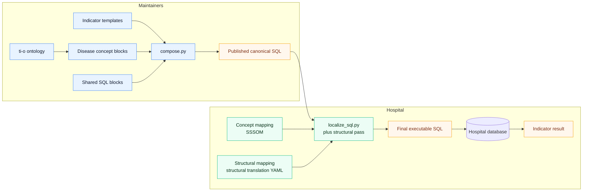

# Indicator Localization Architecture

This diagram shows the full flow from centrally maintained indicator logic to hospital-specific executable SQL.

## Reading Guide

- Canonical logic is built once by maintainers.
- Concept mapping chooses which local codes represent ti-o concepts.
- Structural mapping chooses where canonical fields come from in local schema.
- Hospitals should only localize mappings, not change indicator logic.
